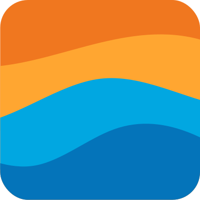

# 🎹 Nimbus Keyboards

<div align="center">

[](https://nextjs.org/)
[](https://www.typescriptlang.org/)
[](https://threejs.org/)
[](https://prismic.io/)
[](https://tailwindcss.com/)
[](https://greensock.com/gsap/)

[View Demo](https://nimbus-keyboards.vercel.app) · [Report Bug](https://github.com/OussamaAitikhlef/nimbus-keyboards/issues) · [Request Feature](https://github.com/OussamaAitikhlef/nimbus-keyboards/issues)



An immersive keyboard showcase and e-commerce platform featuring interactive 3D models, real-time customization, and mechanical switch sound testing.

</div>

## ✨ Features

- 🎨 3D Keyboard Visualization with Three.js
- 🔊 Interactive Switch Sound Testing
- 🛍️ Integrated E-commerce with Stripe
- 📱 Responsive Design
- ⚡ Fast Page Loads with Next.js
- 📝 Content Management with Prismic CMS

## 🛠️ Tech Stack

<details>
<summary>Click to expand</summary>

### Frontend

- 
- 
- 
- 

### 3D & Animation

- 
- 

### CMS & Payment

- 
- 

### Development

- 
- 
- 

</details>

## Getting Started

### Prerequisites

-  (v18 or higher)
-  (or npm/yarn)

### Installation

1. Clone the repository

```bash
git clone https://github.com/OussamaAitikhlef/nimbus-keyboards.git
cd nimbus-keyboards
```

2. Install dependencies

```bash
pnpm install
```

3. Set up environment variables

```bash
# Create a .env.local file with the following variables
NEXT_PUBLIC_PRISMIC_ACCESS_TOKEN=your_prismic_token
NEXT_PUBLIC_STRIPE_PUBLISHABLE_KEY=your_stripe_publishable_key
STRIPE_SECRET_KEY=your_stripe_secret_key
```

4. Run the development server

```bash
pnpm dev
```

The application will be available at [http://localhost:3000](http://localhost:3000)

## 📁 Project Structure

<details>
<summary>Click to see the project structure</summary>

```bash
src/
├── app/                  # Next.js app directory with routes and API endpoints
│   ├── api/             # API routes for Stripe checkout, previews, etc.
│   ├── success/         # Order success page
│   └── layout.tsx       # Root layout with global styles
├── components/          # Reusable React components
│   ├── Keyboard.tsx    # 3D Keyboard component
│   ├── Switch.tsx      # Interactive switch component
│   └── ...            # Other UI components
├── slices/             # Prismic CMS slice components
│   ├── Hero/          # Hero section with 3D scene
│   ├── ColorChanger/  # Keyboard color customization
│   └── ...           # Other content slices
└── checkout.ts         # Stripe checkout integration
```

</details>

## Features in Detail

### 3D Keyboard Visualization

- Interactive 3D models of keyboards and switches
- Real-time color customization
- Dynamic lighting and shadows

### Switch Playground

- Test different mechanical switch sounds
- Multiple switch types available (Red, Blue, Brown, Black)
- Interactive switch animation

### Content Management

- Prismic CMS integration for dynamic content
- Customizable product information
- Flexible page layouts with slice components

### E-commerce

- Secure checkout with Stripe
- Product variant selection
- Order success handling

## Development

### Scripts

- `pnpm dev` - Start development server with Turbopack
- `pnpm build` - Build production application
- `pnpm start` - Start production server
- `pnpm lint` - Run ESLint
- `pnpm slicemachine` - Start Prismic Slice Machine

## 🤝 Contributing

Contributions are what make the open source community such an amazing place to learn, inspire, and create. Any contributions you make are **greatly appreciated**.

1. Fork the repository
2. Create your feature branch (`git checkout -b feature/AmazingFeature`)
3. Commit your changes (`git commit -m 'feat: Add some AmazingFeature'`)
4. Push to the branch (`git push origin feature/AmazingFeature`)
5. Open a Pull Request

## 📝 License

This project is licensed under the MIT License. See the [LICENSE](LICENSE) file for details.

## 🙏 Acknowledgments

- [Three.js](https://threejs.org/) for 3D rendering
- [React Three Fiber](https://docs.pmnd.rs/react-three-fiber) for React integration
- [Prismic](https://prismic.io/) for content management
- [Stripe](https://stripe.com/) for payment processing
- [GSAP](https://greensock.com/gsap/) for animations

## 📬 Contact

Oussama Aitikhlef - [@twitter_handle](https://twitter.com/your_twitter) - email@example.com

Project Link: [https://github.com/OussamaAitikhlef/nimbus-keyboards](https://github.com/OussamaAitikhlef/nimbus-keyboards)
